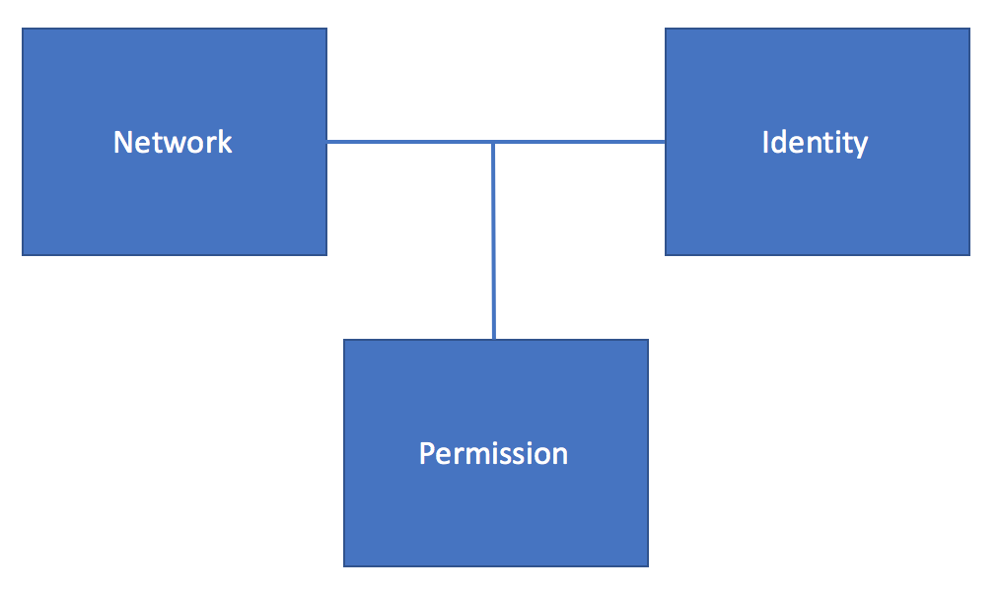

# A Blockchain network

## Network Resources, Identities and Permissions

Hyperledger Fabric is a technology designed to address the diverse needs of the multiple organizations who collaborate in a blockchain network. Because of the many requirements that arise in these networks, **Hyperledger Fabric has a rich set of concepts** that you may initially find slightly overwhelming! Don't worry though -- the principles that underly these concepts are quite straightforward to understand if you group them into three categories: **Resources**, **Identities** and **Permissions**.

Let's help you to first understand these categories, and introduce some of the terms in each category. You don't need to understand all the terms on first reading, just try to understand the categories and why they are important.

## Network Resources

Think of **network resources** as the fundamental **building blocks** that you use to construct the network. For example, you'll see that  a **network** is partitioned into **channels** that enable private communications between the different members of a **consortium**. Moreover, within a channel, you'll see that **ledgers** and **smart contracts** that are hosted on **peers** which endorse and validate transactions that are sequenced and distributed by **orderers**.

The **cooperating organizations** in a network use these resources to **provide services** for the **consumers of the network**. You'll learn more about each of these individual resources as you read the [Concepts](./KeyConcepts.md) section and try out the real-world DRIVENET example. But for now, think of these resources as the most fundamental elements of form the network.

## Identity

**Every thing** and everyone that consume services of a Hyperledger Fabric network **requires an identity**.  For example you'll see that **users**, **administrators**, **applications**, **Certificate Authorities** and **organizations** all have to identify themselves whenever they interact with the network. Hyperledger Fabric has a general term for anything that has an identity -- a principal. **Principals are the main consumers of the network**.

You'll see that sometimes **network resources** -- the fundamental building blocks -- **have an identity too**. That's because one part of the network can sometimes consume services from a different part of the network. For example, you'll see that peers and orderers use channel services to communicate with between themselves and applications. Because of this relationship between the components of the network, network resources can also be principals in the network.

You'll discover why identities are important in a moment, and later on, you'll start to understand the importance of a **public key infrastructure** (PKI) to **establish trusted identities**. But for now, just remember that there are lots of identities associated with a network.

## Permissions

**Permissions are the final piece of the Hyperledger Fabric puzzle**, and are the concept that make Hyperledger Fabric different from most other blockchains.   

**Permissions describe the rights that different principals have over different network resources**. For example, applications may have permission to read from a ledger, but not to write to it. Similarly, administrators may have permission to change the organizations in a channel, but not the organizations in a network consortium. As you can see from the diagram, permissions are associative -- they require both resources and identities to exist before they can be defined. That's because they define the relationship between principals and resources, and only make sense once both these elements exist.

Hyperledger Fabric makes **extensive use of permissions** to support **networks with different constitutions**. For example, a network can be defined where every organization has equal permissions over resources. At the other extreme, a network can be set up where a single organization has overall control.

Most interestingly, the permissions may also define the rights to **modify the current permissions** -- to support the fact that organizations may adapt and evolve their relationships with each other over time. For example, a network which was initially configured with three organizations, two of which can control it, could be modified by either of the these two organizations to grant the third organization equal rights.

On a conceptual level, it's important to remember that permissions are what's important, not the *instance* of a component that's trying to do something. It doesn't actually matter whether a peer or an application or a Certificate Authority is trying to do something. What matters is its identity, which is stored in the network, and the permissions associated with that identity. Although in the real world certain permissions are likely to be associated with certain components, it is possible to give a Certificate Authority the permission to query the ledger, for example, which is not something it would normally do.

While this provides the greatest degree of flexibility to the founders and administrators of a Fabric network, it means that the permissions structure of components in the network must be thought through very carefully.

## That's it!

That was easy, wasn't it? We can summarize Hyperledger Fabric as a technology which helps users build blockchain network, which is consumed by principals with identities, with agreed and evolving rights over the different types of resources that make up the network.

And if you think about it for a little while, any computer system can be described in this way - a set of resources, principals, and permissions.  The thing we now need to do is understand the concepts in more details, and how they interact with each other!

[Next:Consortia](./Consortia.md)
